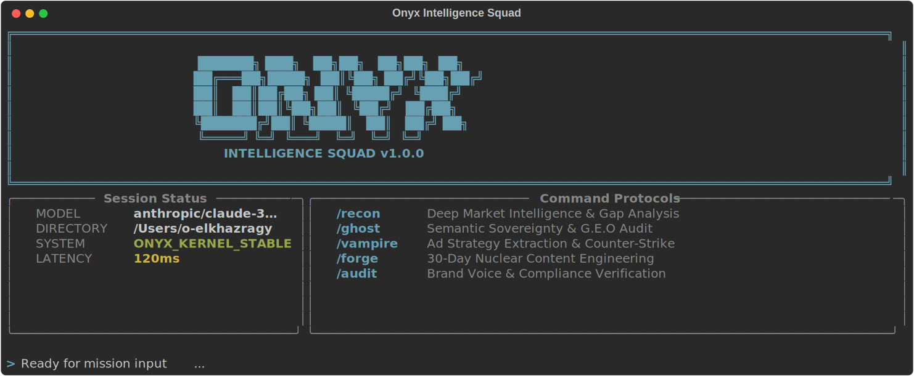

# TAMO Intelligence Squad

### The open-source growth engineering engine.

TAMO is a multi-agent framework designed to automate deep market penetration, semantic sovereignty (G.E.O), and high-velocity content engineering. It transforms your CLI into a mission control for growth.

## Visual Interface


## Installation

### macOS / Linux:
```bash
curl -fsSL https://raw.githubusercontent.com/mohamedOmar11111/tamo-intelligence-squad/main/install.sh | bash
```

### Windows (PowerShell):
```powershell
irm https://raw.githubusercontent.com/mohamedOmar11111/tamo-intelligence-squad/main/install.ps1 | iex
```

> **Note:** Installation creates a global `tamo` alias. Restart your terminal after install.

## Command Protocols

| Command | Squad | Purpose |
| :--- | :--- | :--- |
| `/recon` | **The Scout** | Deep competitor audit and market gap analysis. |
| `/ghost` | **The Shadow** | SEO to G.E.O transition & AI citable content. |
| `/vampire` | **The Hunter** | Ad strategy extraction and counter-copy generation. |
| `/forge` | **The Smith** | 30-day nuclear content calendar engineering. |
| `/audit` | **The Warden** | Brand voice compliance and linguistic verification. |

## Why TAMO?
Traditional marketing is an experiment. **TAMO is a system.** By deploying specialized squads that follow strict Markdown-based protocols, you eliminate fluff and execute with algorithmic precision.

---
Built by [Mohamed Omar](https://github.com/mohamedOmar11111) | Growth Architect.
